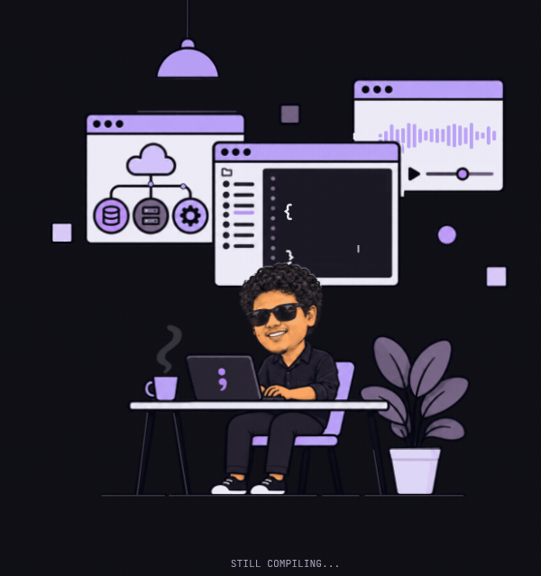

# Hi, I’m Shreyas.

**I build things. I write to understand.**

  <picture>
    <source media="(prefers-reduced-motion: reduce)" srcset="assets/shrys-workspace-day-night-v2-still.png">
    
  </picture>

I’m a co-founder and software engineer. I lead teams, design systems, and stay
close to the code, working across Rust libraries, blockchain infrastructure,
and developer tools.

[Website](https://shrys.xyz/) · [INVARIANT](https://shrys.xyz/invariant/) · [LinkedIn](https://www.linkedin.com/in/shreyas-ks)

## Selected work

Projects I’ve helped shape as a technical lead and architect:

- **[toon-rust](https://github.com/toon-format/toon-rust)** — Built TOON’s Rust
  implementation: parser, serializer, Serde API, and command-line tools.
- **[Arkeo](https://github.com/arkeonetwork/arkeo)** — Led architecture and
  engineering on blockchain data infrastructure, including Cosmos SDK migration,
  validator rewards, and protocol security improvements.
- **[DIVE](https://github.com/shreyasbhat0/DIVE)** — Built the CLI and deployment
  workflows for blockchain nodes, smart contracts, and cross-chain bridges.
- **[DAW Buddy](https://github.com/hrdsht/daw_buddy)** — Shaped the desktop
  architecture and built tools for music producers, from project search to
  missing-sample detection.

[More projects and contributions →](https://shrys.xyz/projects/)

## Writing to understand

I write **INVARIANT**, a technical journal on Rust, systems, and software
correctness. A couple of places to start:

- [Invariants in the Wild](https://shrys.xyz/posts/invariants-in-toon-rust/) —
  What implementing TOON’s Rust parser taught me about the promises in a format.
- [The Contract Before the Code](https://shrys.xyz/posts/the-contract-before-the-code/) —
  Understanding operating systems through the guarantees they make.

Currently exploring operating systems, database internals, and deterministic
workflows around AI agents.
