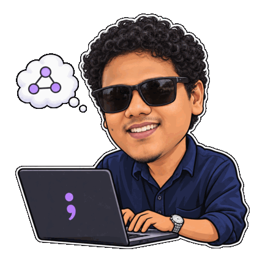

# Hi, I’m Shreyas.

**Built from curiosity.**  **Written from experience.**

I’m a co-founder, technical lead, and software architect. I turn ideas into working software and help teams do the same, staying involved from the first design decisions through implementation.

My work spans Rust libraries, blockchain infrastructure, developer tools, and software for music producers.

[shrys.xyz](https://shrys.xyz/) · [INVARIANT](https://shrys.xyz/invariant/) · [LinkedIn](https://www.linkedin.com/in/shreyas-ks)

  <picture>
    <source media="(prefers-reduced-motion: reduce)" srcset="assets/profile-still.png">
    
  </picture>

## From architecture to implementation

A few projects I’ve helped shape:

- **[toon-rust](https://github.com/toon-format/toon-rust)**: Architected and built TOON’s Rust implementation, from parsing and serialization to the Serde API and command-line tools.
- **[Arkeo](https://github.com/arkeonetwork/arkeo)**: Led architecture and engineering on blockchain data infrastructure, including Cosmos SDK migration, validator rewards, and protocol security improvements.
- **[DIVE](https://github.com/shreyasbhat0/DIVE)**: Designed and built the CLI and deployment workflows for blockchain nodes, smart contracts, and BTP/IBC bridges.
- **[DAW Buddy](https://github.com/hrdsht/daw_buddy)**: Shaped the desktop architecture and built tools for music producers, including project search, waveform trimming, and missing-sample detection.

[More projects and contributions →](https://shrys.xyz/projects/)

## Writing at INVARIANT

I write about Rust, systems, and the guarantees that make software dependable. The articles connect implementation details with the reasoning behind them.

- [Invariants in the Wild](https://shrys.xyz/posts/invariants-in-toon-rust/): Lessons from implementing TOON’s Rust parser.
- [The Contract Before the Code](https://shrys.xyz/posts/the-contract-before-the-code/): The promises an operating system makes to every program.
- [What Is a Database, Really?](https://shrys.xyz/posts/what-is-a-database-really/): The guarantees behind storage, transactions, and recovery.

## Currently exploring

Operating systems and kernel internals, storage engines and database design, and deterministic workflows around AI agents.
